# Jarkom-Modul-5-A15-2021

Laporan Resmi Modul 5 Jaringan Komputer Kelompok A15

## Anggota Kelompok :

|      NRP       |     Nama     |
| :------------: | :----------: |
| 05111940000034 | Aimar Wibowo |
| 05111940000064 | Ifanu Antoni |

&nbsp;

## Topologi

Berikut adalah topologi yang dibuat :
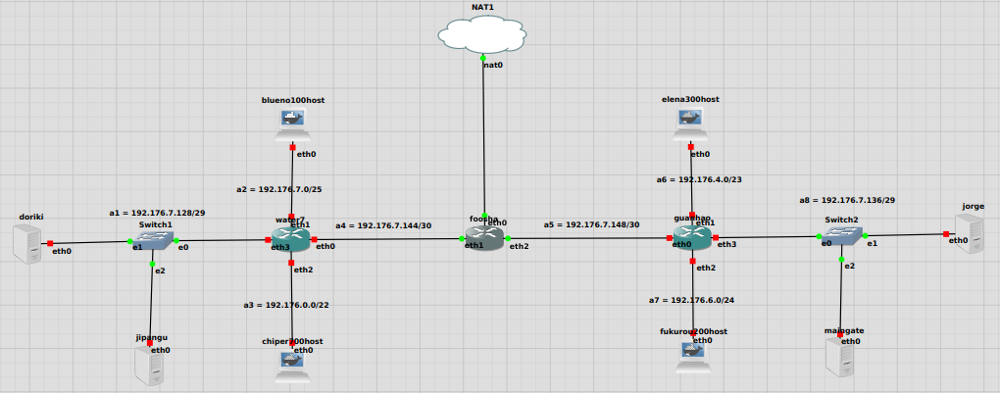

## Subnetting (VLSM)

### Pembagian Subnet

|  Subnet   | Jumlah IP | Netmask |
| :-------: | :-------: | :-----: |
|    A1     |     3     |   /29   |
|    A2     |    101    |   /25   |
|    A3     |    701    |   /22   |
|    A4     |     2     |   /30   |
|    A5     |     2     |   /30   |
|    A6     |    301    |   /23   |
|    A7     |    201    |   /24   |
|    A8     |     3     |   /29   |
| **Total** | **1314**  | **/21** |

### VLSM Tree

Berikut adalah VLSM tree yang kami buat
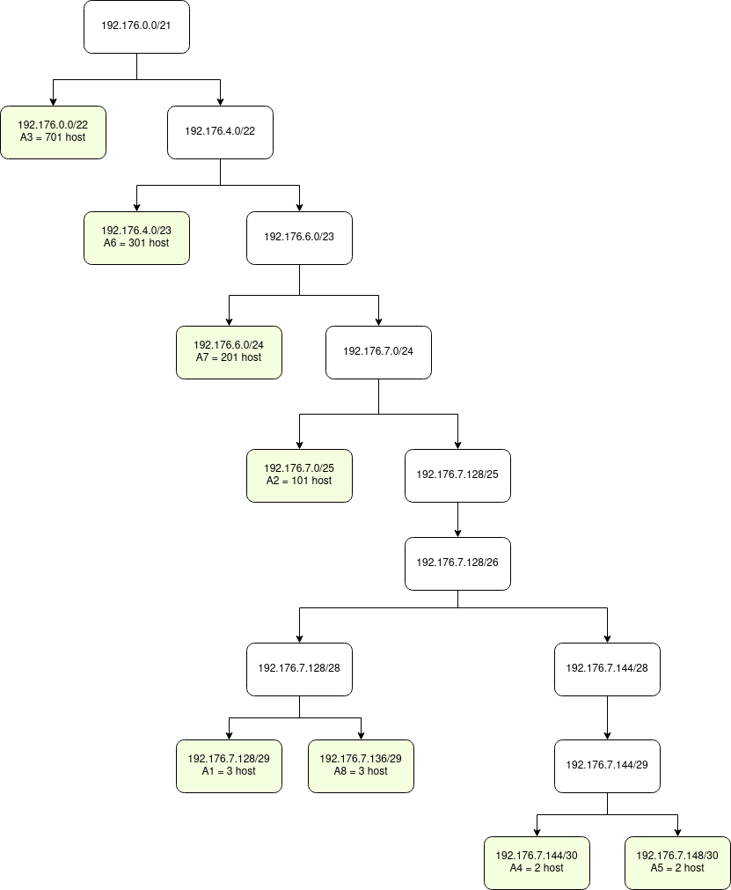

### Pembagian IP

| Subnet |  Network ID   |     Netmask     |
| :----: | :-----------: | :-------------: |
|   A1   | 192.176.7.128 | 255.255.255.248 |
|   A2   |  192.176.7.0  | 255.255.255.128 |
|   A3   |  192.176.0.0  |  255.255.252.0  |
|   A4   | 192.176.7.144 | 255.255.255.252 |
|   A5   | 192.176.7.148 | 255.255.255.252 |
|   A6   |  192.176.4.0  |  255.255.254.0  |
|   A7   |  192.176.6.0  |  255.255.255.0  |
|   A8   | 192.176.7.136 | 255.255.255.248 |

## Setting GNS3

**FOOSHA (sebagai Router / DHCP Relay)**

```
# DHCP config for eth0
auto eth0
iface eth0 inet dhcp

# Static config for eth1
auto eth1
iface eth1 inet static
	address 192.176.7.145
	netmask 255.255.255.252

# Static config for eth2
auto eth2
iface eth2 inet static
	address 192.176.7.149
	netmask 255.255.255.252
```

**WATER7 (sebagai Router / DHCP Relay)**

```
# Static config for eth0
auto eth0
iface eth0 inet static
	address 192.176.7.146
	netmask 255.255.255.252
	gateway 192.176.7.145
	up echo nameserver 192.168.122.1 > /etc/resolv.conf

# Static config for eth1
auto eth1
iface eth1 inet static
	address 192.176.7.1
	netmask 255.255.255.128

# Static config for eth2
auto eth2
iface eth2 inet static
	address 192.176.0.1
	netmask 255.255.252.0

# Static config for eth3
auto eth3
iface eth3 inet static
	address 192.176.7.129
	netmask 255.255.255.248
```

**GUANHAO (sebagai Router / DHCP Relay)**

```
# Static config for eth0
auto eth0
iface eth0 inet static
	address 192.176.7.150
	netmask 255.255.255.252
	gateway 192.176.7.149
	up echo nameserver 192.168.122.1 > /etc/resolv.conf

# Static config for eth1
auto eth1
iface eth1 inet static
	address 192.176.4.1
	netmask 255.255.254.0

# Static config for eth2
auto eth2
iface eth2 inet static
	address 192.176.6.1
	netmask 255.255.255.0

# Static config for eth3
auto eth3
iface eth3 inet static
	address 192.176.7.137
	netmask 255.255.255.248
```

**DORIKI (sebagai DNS Server)**

```
# Static config for eth0
auto eth0
iface eth0 inet static
	address 192.176.7.130
	netmask 255.255.255.248
	gateway 192.176.7.129
	up echo nameserver 192.168.122.1 > /etc/resolv.conf
```

**JIPANGU (sebagai DHCP Server)**

```
# Static config for eth0
auto eth0
iface eth0 inet static
	address 192.176.7.131
	netmask 255.255.255.248
	gateway 192.176.7.129
	up echo nameserver 192.168.122.1 > /etc/resolv.conf
```

**JORGE (sebagai Web Server)**

```
# Static config for eth0
auto eth0
iface eth0 inet static
	address 192.176.7.138
	netmask 255.255.255.248
	gateway 192.176.7.137
	up echo nameserver 192.168.122.1 > /etc/resolv.conf
```

**MAINGATE (sebagai Web Server)**

```
# Static config for eth0
auto eth0
iface eth0 inet static
	address 192.176.7.139
	netmask 255.255.255.248
	gateway 192.176.7.137
	up echo nameserver 192.168.122.1 > /etc/resolv.conf

```

**BLUENO (sebagai Client)**

```
# DHCP config for eth0
auto eth0
iface eth0 inet dhcp
```

**CIPHER (sebagai Client)**

```
# DHCP config for eth0
auto eth0
iface eth0 inet dhcp
```

**ELENA (sebagai Client)**

```
# DHCP config for eth0
auto eth0
iface eth0 inet dhcp
```

**FUKUROU (sebagai Client)**

```
# DHCP config for eth0
auto eth0
iface eth0 inet dhcp
```

## Routing

**Foosha**

```
#routing untuk subnet A1,A2,A3,A4
route add -net 192.176.7.0 netmask 255.255.255.128 gw 192.176.7.146
route add -net 192.176.0.0 netmask 255.255.252.0 gw 192.176.7.146
route add -net 192.176.7.128 netmask 255.255.255.248 gw 192.176.7.146

#routing untuk subnet A5,A6,A7,A8
route add -net 192.176.4.0 netmask 255.255.254.0 gw 192.176.7.150
route add -net 192.176.6.0 netmask 255.255.255.0 gw 192.176.7.150
route add -net 192.176.7.136 netmask 255.255.255.248 gw 192.176.7.150

```

## Setting DHCP Relay

**Pada WATER7 dan GUANHAO**

1. Install aplikasi isc-dhcp-relay.

```
apt-get install isc-dhcp-relay -y
```

2. Edit file `/etc/default/isc-dhcp-relay`

```
SERVERS="192.176.7.131"
INTERFACES="eth0 eth1 eth2 eth3"
OPTIONS=""
```

3. Restart isc-dhcp-relay.

```
service isc-dhcp-relay restart
```

## Setting DHCP Server

**Pada JIPANGU**

1. Install aplikasi isc-dhcp-server.

```
apt-get install isc-dhcp-server -y
```

2. Aktifkan interface untuk DHCP server `/etc/default/isc-dhcp-server`

```
INTERFACES="eth0"
```

3. Edit file `/etc/dhcp/dhcpd.conf` untuk menambahkan subnet sebagai berikut :

```
#a2 blueno
subnet 192.176.7.0 netmask 255.255.255.128 {
	range 192.176.7.2 192.176.7.126;
	option routers 192.176.7.1;
	option broadcast-address 192.176.7.127;
	option domain-name-servers 192.176.7.130,192.168.122.1;
	default-lease-time 600;
	max-lease-time 7200;
}

#a3 chiper
subnet 192.176.0.0 netmask 255.255.252.0 {
	range 192.176.0.2 192.176.3.254;
	option routers 192.176.0.1;
	option broadcast-address 192.176.3.255;
	option domain-name-servers 192.176.7.130,192.168.122.1;
	default-lease-time 600;
	max-lease-time 7200;
}

#a6 elena
subnet 192.176.4.0 netmask 255.255.254.0 {
	range 192.176.4.2 192.176.5.254;
	option routers 192.176.4.1;
	option broadcast-address 192.176.5.255;
	option domain-name-servers 192.176.7.130, 192.168.122.1;
	default-lease-time 600;
	max-lease-time 7200;
}


# Fukurou A7
subnet 192.176.6.0 netmask 255.255.255.0 {
	range 192.176.6.2 192.176.6.254;
	option routers 192.176.6.1;
	option broadcast-address 192.176.6.255;
	option domain-name-servers 192.176.7.130, 192.168.122.1;
	default-lease-time 600;
	max-lease-time 7200;
}

subnet 192.176.7.128 netmask 255.255.255.248 {
        option routers 192.176.7.129;
}
```

4. Restart isc-dhcp-server.

```
service isc-dhcp-server restart
```

## Setting DNS Server

**Pada DORIKI**

1. Install aplikasi bind9.

```
apt-get install bind9 -y
```

2. Edit file `/etc/bind/named.conf.options` seperti pada gambar berikut :
3. Restart bind9.

```
service bind9 restart
```

&nbsp;

## No 1

Agar topologi yang kalian buat dapat mengakses keluar, kalian diminta untuk mengkonfigurasi Foosha menggunakan iptables, tetapi Luffy tidak ingin menggunakan MASQUERADE.

### Penjelasan nomor 1

Lakukan ip tables pada `foosha` sebagai berikut

```
iptables -t nat -A POSTROUTING -s 192.176.0.0/21 -o eth0 -j SNAT --to-source 192.168.122.103
```

**Testing**

Lakukan ping ke luar jaringan local pada setiap client
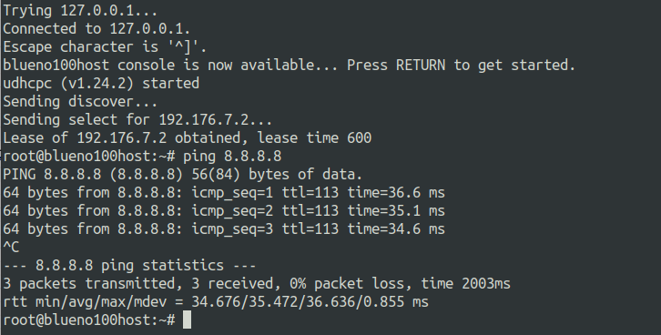
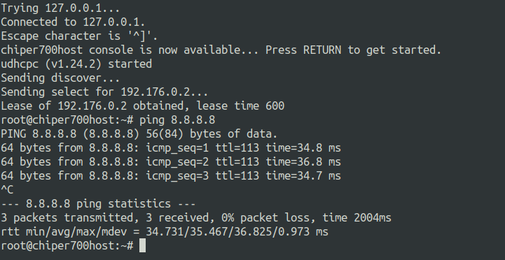
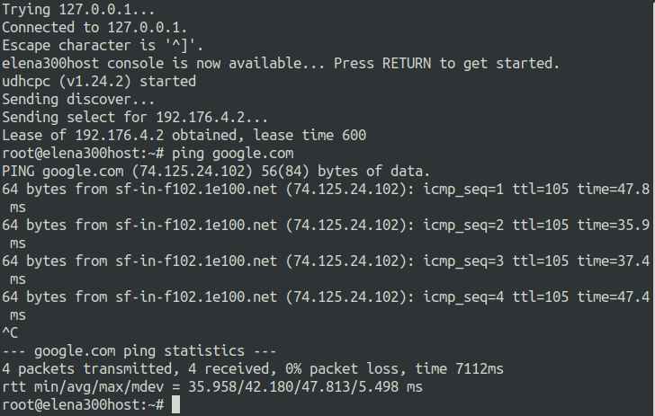
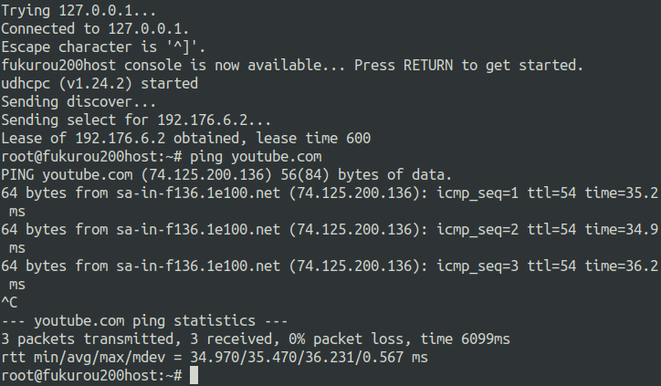

## No 2

Kalian diminta untuk mendrop semua akses HTTP dari luar Topologi kalian pada server yang merupakan DHCP Server dan DNS Server demi menjaga keamanan.

### Penjelasan nomor 2

Lakukan ip tables pada `water7` sebagai berikut

```
iptables -A FORWARD -d 192.176.7.128/29 -p tcp --dport 80 -j DROP
```

**Testing**

Lakukan nmap dari client dengan ip menuju DNS server dan DHCP server,

```
nmap -p 80 [IP DNS/DHCPserver]
```

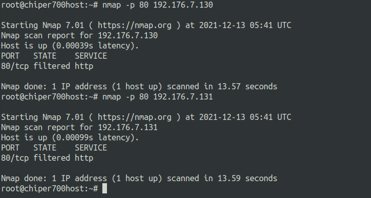

output 80/tcp `filtered http` menunjukan droped akses http berhasil

## No 3

Karena kelompok kalian maksimal terdiri dari 3 orang. Luffy meminta kalian untuk membatasi DHCP dan DNS Server hanya boleh menerima maksimal 3 koneksi ICMP secara bersamaan menggunakan iptables, selebihnya didrop.

### Penjelasan nomor 3

Lakukan ip tables pada `doriki` dan `jipangu` sebagai berikut

```
iptables -A INPUT -p icmp -m connlimit --connlimit-above 3 --connlimit-mask 0 -j DROP
```

**Testing**

Lakukan ping dari client ke DNS server / DHCP server secara bersamaan
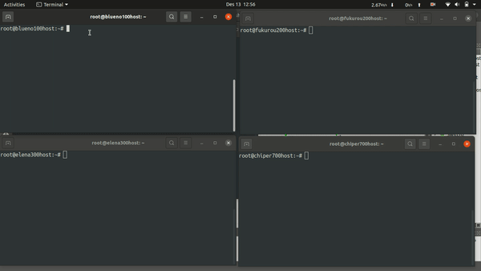

## No 4

Akses dari subnet Blueno dan Cipher hanya diperbolehkan pada pukul 07.00 - 15.00 pada hari Senin sampai Kamis.

### Penjelasan nomor 4

Lakukan ip tables pada `doriki` sebagai berikut

```
#blueno
iiptables -A INPUT -s 192.176.7.0/25 -m time --timestart 07:00 --timestop 15:00 --weekdays Mon,Tue,Wed,Thu -j ACCEPT
iptables -A INPUT -s 192.176.7.0/25 -j REJECT

#chiper
iptables -A INPUT -s 192.176.0.0/22 -m time --timestart 07:00 --timestop 15:00 --weekdays Mon,Tue,Wed,Thu -j ACCEPT
iptables -A INPUT -s 192.176.0.0/22 -j REJECT

```

**Testing**

pada `blueno`

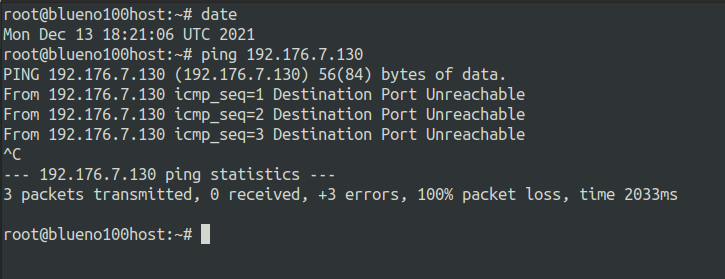

pada `chiper`

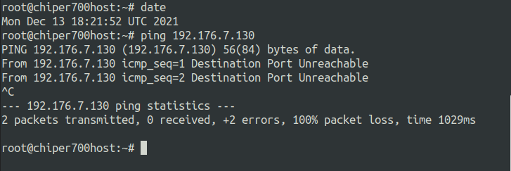

Karena pada saat ping ke IP `doriki` bukan jam kerja maka akses `ditolak`

## No 5

Akses dari subnet Elena dan Fukurou hanya diperbolehkan pada pukul 15.01 hingga pukul 06.59 setiap harinya.

### Penjelasan nomor 5

Lakukan ip tables pada `doriki` sebagai berikut

```
#elena
iptables -A INPUT -s 192.176.4.0/23 -m time --timestart 15:01 --timestop 23:59 -j ACCEPT
iptables -A INPUT -s 192.176.4.0/23 -m time --timestart 00:00 --timestop 06:59 -j ACCEPT
iptables -A INPUT -s 192.176.4.0/23 -j REJECT

#fukuro
iptables -A INPUT -s 192.176.6.0/23 -m time --timestart 15:01 --timestop 23:59 -j ACCEPT
iptables -A INPUT -s 192.176.6.0/23 -m time --timestart 00:00 --timestop 06:59 -j ACCEPT
iptables -A INPUT -s 192.176.6.0/23 -j REJECT

```

**Testing**

pada `elena`

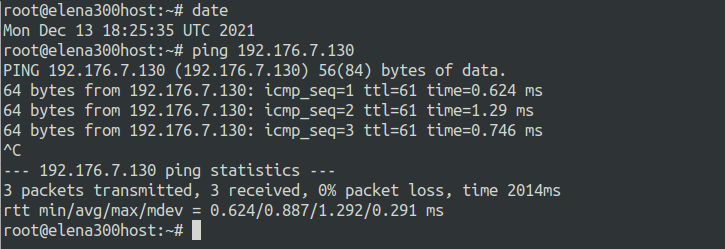

pada `fukurou`

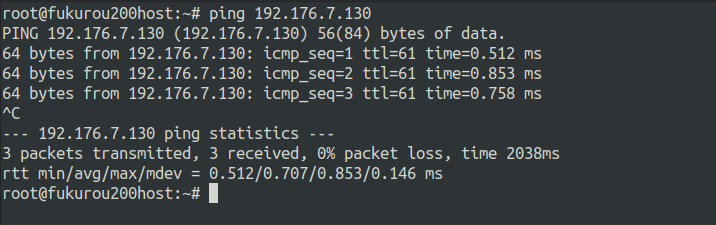

Karena pada saat ping ke IP `doriki` merupakan jam kerja maka akses `diterima`

## No 6

Karena kita memiliki 2 Web Server, Luffy ingin Guanhao disetting sehingga setiap request dari client yang mengakses DNS Server akan didistribusikan secara bergantian pada Jorge dan Maingate.

### Penjelasan nomor 6

Lakukan configurasi

Pada router `guanhao` IP tables sebagai berikut

```
iptables -A PREROUTING -t nat -d 192.176.7.130 -p tcp -m statistic --mode nth --every 2 --packet 0 -j DNAT --to-destination 192.176.7.138
iptables -A PREROUTING -t nat -d 192.176.7.130 -p tcp -j DNAT --to-destination 192.176.7.139
```

Pada web server `jorge` dan `maingate` intsall apache2

```
apt-get update
apt-get install apache2 -y
```

beri keterangan dengan configure file `/var/www/html/index.html`

```
<!-- ntuk server jorge -->
server jorge
```

```
<!-- ntuk server maingate -->
server maingate
```

restart apache2

```
service apache2 restart
```

**Testing**

Lakukan curl dari client menuj IP `doriki` maka akan dirahan secara bergantian ke web server

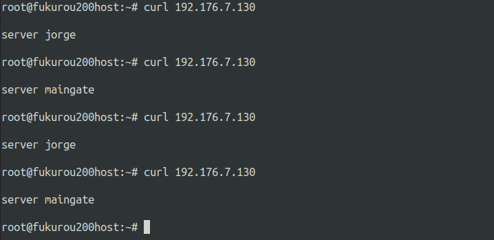

&nbsp;

## Kendala

1. Waktu yang meper karena yang bersamaan dengan banyak FP
